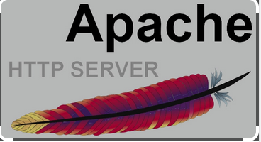
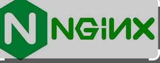
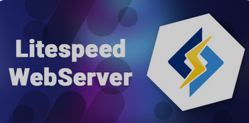
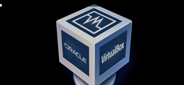
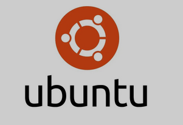

---
Name: your name
course: cis106
semester: spring 2024
----
# Deliverable 1

> Tutorial can be found [here]https://www.digitalocean.com/community/tutorials/initial-server-setup-with-ubuntu

## Conscepts I don't understand:

* Web server

* Apache

* Firewall

##  What is a web server? Hardware and software side

*The term web server can refer to hardware or software, or both of them working together. On the hardware side, a web server is a computer that stores web server software and a website's component files (for example, HTML documents, images, CSS stylesheets, and JavaScript files)*

##  What are some different web server applications?

*Apache HTTP Server: One of the oldest and most widely used web servers. It's known for its stability, flexibility, and extensive module support.*

Nginx: Pronounced as "engine-ex," it's known for its high performance, scalability, and ability to handle large numbers of concurrent connections efficiently. It's often used as a reverse proxy server as well.

LiteSpeed Web Server: Known for its high performance and low resource usage, LiteSpeed is a commercial web server with a free version available as well.

##  What is virtualization?

*Virtualization is a process that allows for more efficient use of physical computer hardware and is the foundation of cloud computing.

Virtualization uses software to create an abstraction layer over computer hardware, enabling the division of a single computer's hardware components—such as processors, memory and storage—into multiple virtual machines (VMs). Each VM runs its own operating system (OS) and behaves like an independent computer, even though it is running on just a portion of the actual underlying computer hardware.*
##  What is virtualbox? 
*VirtualBox is a powerful x86 and AMD64/Intel64 virtualization product for enterprise as well as home use. Not only is VirtualBox an extremely feature rich, high performance product for enterprise customers, it is also the only professional solution that is freely available as Open Source Software under the terms of the GNU General Public License (GPL) version 3. See "About VirtualBox" for an introduction.*

##  What is a virtual machine?
*A VM is a computer file that behaves like an actual physical personal computer (PC). It has its own CPU, memory, storage, and network interface card (NIC) — created from a physical server — that allows it to run its own operating system (OS) and application environment separate from the dedicated hardware.*

*While the parts (CPU, memory, storage, and NICs) that make up your PC are physical and tangible, VMs are software-defined computers or virtualized computers within physical hosts, existing only as code. Since VMs are abstracted from the rest of dedicated hardware, many of them can exist on a single piece of hardware. You can also move them easily between host servers depending on demand and efficiently use the dedicated hardware’s resources.* 

*VMs also allow multiple different OSes to run simultaneously on a single hardware system. For example, you can run Windows, Linux, and macOS on the same PC, and each OS runs precisely as it would on the host hardware. As such, the end-user experience emulated within a VM is nearly identical to that you’d expect on a physical machine.*

##  What is Ubuntu Server?
*Ubuntu Server is a variant of the Ubuntu operating system designed specifically to run server applications. It's based on the Debian Linux distribution and is known for its stability, regular updates, and extensive support and community resources. Ubuntu Server provides a robust platform for hosting websites, databases, cloud computing, and other server-based tasks. It comes with a wide range of server-oriented software packages and tools, making it popular among both small-scale and enterprise-level deployments.*

##  What is a firewall?
*A firewall is a network security device that monitors incoming and outgoing network traffic and decides whether to allow or block specific traffic based on a defined set of security rules.*

##   What is SSH?
*SSH, also known as Secure Shell or Secure Socket Shell, is a network protocol that gives users, particularly system administrators, a secure way to access a computer over an unsecured network.*

SSH also refers to the suite of utilities that implement the SSH protocol. Secure Shell provides strong password authentication and public key authentication, as well as encrypted data communications between two computers connecting over an open network, such as the internet.*

*In addition to providing strong encryption, SSH is widely used by network administrators to manage systems and applications remotely, enabling them to log in to another computer over a network, execute commands and move files from one computer to another*.

