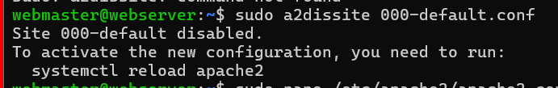
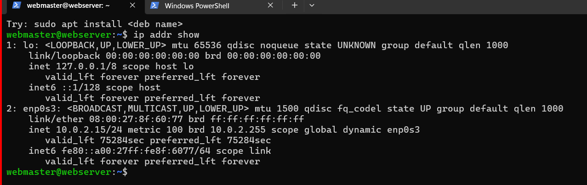

---
Name: your name
course: cis106
semester: spring 2024
----
# Deliverable 2 Submission 

# Server Specifications 

# Ubuntu login Screen 

# 3.What is the IP address of your Ubuntu Server Virtual Machine?
  *An IP address (Internet Protocol address) is a numerical label assigned to each device connected to a computer network that uses the Internet Protocol for communication.* 

# 4.How do you enable the Ubuntu Firewall?

*To enable the firewall on Ubuntu, you typically use a utility called ufw (Uncomplicated Firewall), which provides a straightforward command-line interface for managing firewall rules. Here's how you can enable the Ubuntu Firewall using ufw:*
for is example sudo ufw status*

# 5.How do you check if the Ubuntu Firewall is running?

*UFW, or Uncomplicated Firewall, is an interface to iptables that is geared towards simplifying the process of configuring a firewall. While iptables is a solid and flexible tool, it can be difficult for beginners to learn how to use it to properly configure a firewall. If you’re looking to get started securing your network, and you’re not sure which tool to use, UFW may be the right choice for you.*

# 6.How do you disable the Ubuntu Firewall?

*In Ubuntu, the default firewall management tool is typically ufw (Uncomplicated Firewall). You can disable the firewall by stopping and disabling the ufw service. Here's how you can do it:*

# 7.How do you add Apache to the Firewall?
*To add Apache to the Ubuntu Firewall (UFW), you need to allow incoming connections on the default HTTP port (TCP port 80). Here's how you can do it:
*sudo apt update; sudo apt upgrade -y

# 8.What is the command you used to install Apache?
*sudo apt install apache2 -y
This command updates the package lists (apt update) and then installs the Apache HTTP server (apache2) along with any necessary dependencies. The sudo command is used to run these commands with superuser privileges.*

# 9.What is the command you use to check if Apache is running?
To check if Apache is running on a Linux system, you can use the systemctl command, which is used to control services in modern Linux distributions that use systemd. Here's the command to check if Apache is running: systemctl status apache2  systemctl status ssh

# 10.What is the command you use to stop Apache?
*To stop the Apache service on a Linux system, you can use the systemctl command if your distribution uses systemd. Here's the command to stop Apache:* sudo systemctl stop apache2

# 11.What is the command you use to restart Apache?
to restart the Apache service on Linux system,you can use the systemtl command if your distribution uses systemd. here the command to restart Apache2 
sudo systemctl restart apache2 

# 12.What is the command used to test Apache configuration?
To test the Apache configuration for syntax errors or other issues, you can use the apachectl command with the -t option. This command checks the configuration files for correctness without actually restarting the Apache service  here an example 
sudo apachectl1 configtest 

# 13.What is the command used to check the installed version of Apache?
*To check the installed version of Apache, you can use the apache2ctl command with the -v option. This command displays the Apache server version along with some other information. Here's the command: systemctl status apache2 systemctl status ssh* 

# 14.What are the most common commands to troubleshoot Apache errors? Provide a brief description of each command.

*tail: The tail command is used to display the last few lines of a file, which is particularly useful for viewing the end of log files where Apache errors are often recorded.Example:*tail -n 100 /var/log/apache2/error.log

*grep: The grep command is used to search for specific patterns or keywords within files. It's often used in conjunction with tail to filter Apache error logs for relevant information.Example:*tail -n 100 /var/log/apache2/error.log | grep "error"

# 15.Which are Apache Log Files, and what are they used for? Provide examples and screenshots.

Several common commands can be useful for troubleshooting Apache errors. Here are some of them:

tail: Use the tail command to view the end of a log file, which is often where the most recent error messages are located. For example: