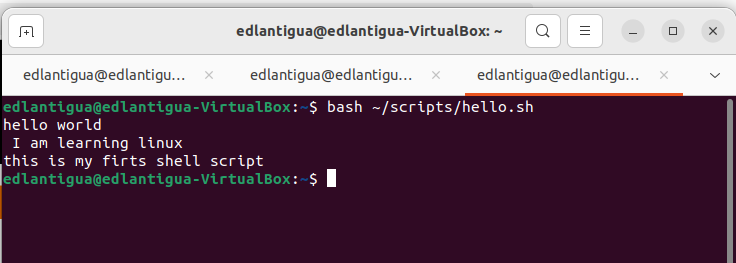

# week report 3
## completed work for week 3
* [Lab 3](../../labs/lab3/lab3.md)
* [notes 1](../../notes/notes1/notes1.md)

### practice 2: Accessing the bash shell

### Practice 3: Using the command history

### Practice 4: My firts shell script

### Practice 5: Using man 

### Practice 6: Using help

### Practice 7: Using cheat

