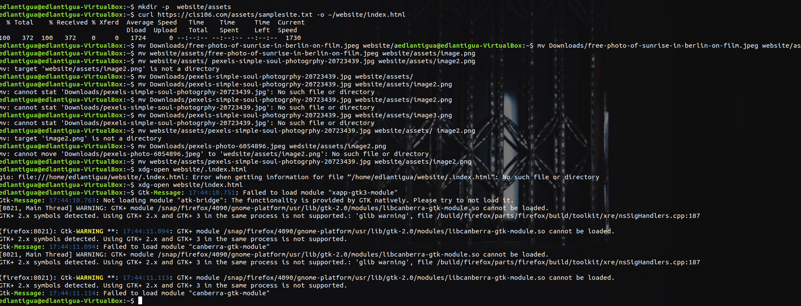
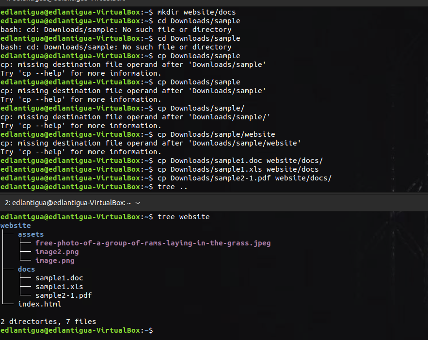

# Week Reports 5

## Answer to questions:

* **what are the Command options?**
  *In Linux, command options (also known as command-line options or flags) are additional parameters that can be passed to commands to modify their behavior*
  
* **What are the Command Arguments**
  *Command arguments are parameters passed to a command when it is executed. These arguments provide additional information to the command, influencing its behavior or determining the operation it should perform.*

* **which command is used for creating directories ? provide at least  examples**
 *The command used for creating directories in Linux is mkdir (short for "make directory"). Here are some examples of how to use the mkdir command* example mkdir directory_coco  , mkdir directory1 directory00 directoy2 mkdir -m  755 directory banana.
  
* **what does the touch command do ? provide at least 3 examples?**
   *The touch command is used to create an empty file or update the timestamps (access and modification) of existing files.* *here examples touch new_file.txt
    touch existing_file.txt 
    touch file1.txt file2.txt file3.txt.*
  
* **How do you remove a file Provide an examples.**
  *To remove a file you use `rm command which stands for "remove".*Here's example* **rm file.txt or rm file1.txt file2.txt/*.

* **How do you remove a directory and can you remove non-empty directories in Linux provide an example**
 *To roemove a directory in Linux, you use the `rmdir` command for empty directories or the command with the the` -r`  examples rmdir empty_directory and rm -r non_empty_directory*.

* **Explain the mv and cp commands .provide at least 2 examples of each**
*Both `mv` and `cp` are command used for file manipulation Linux.
mv(Move)*
*The mv The mv command is used to move files or directories from one location to another. It can also be used to rename files or directories. exmaple mv file.txt /path/to/destination/ and mv old filelicey.txt new filelicey.txy*

cd(Copy)
*The `cp command is used to copy files or directories form one location to another.* Example cp file.txt /path/to/destination/
or cp -r directory /path//to/destination/
## Practice 1

## practice 2

## Practice 3

## Practice 4

